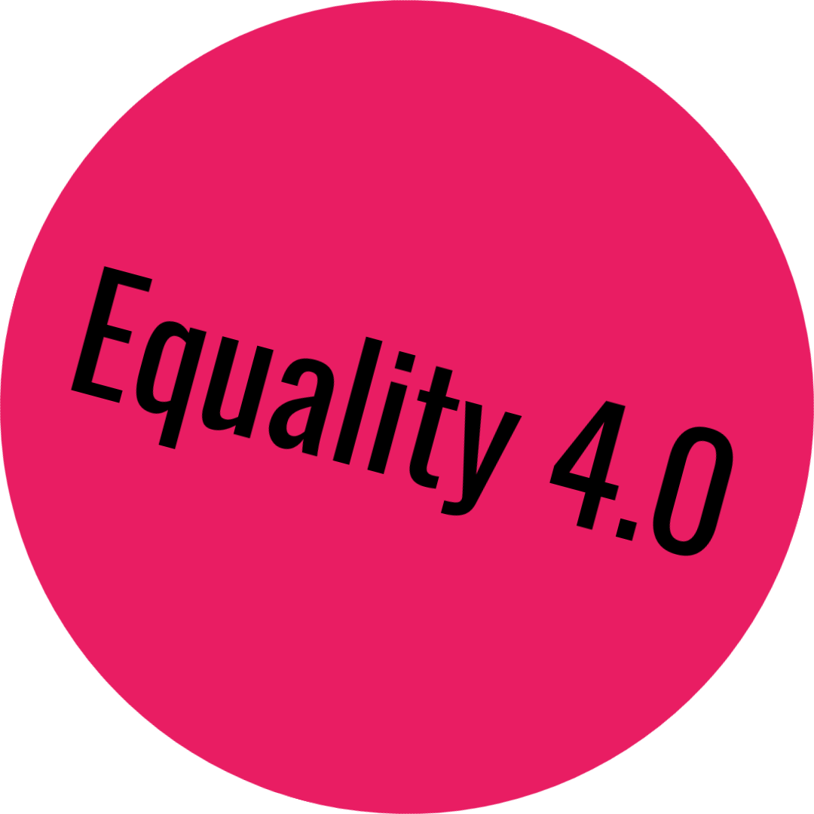
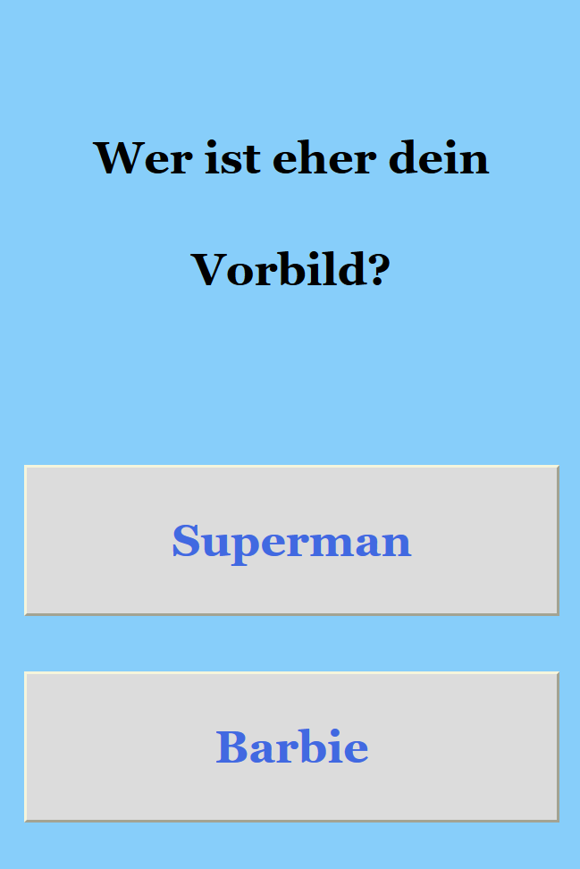
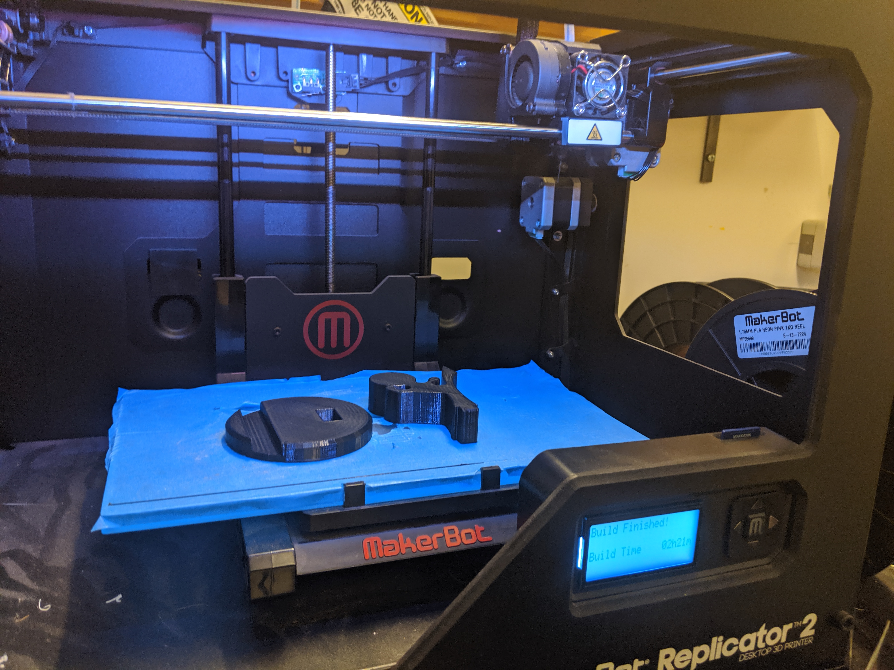
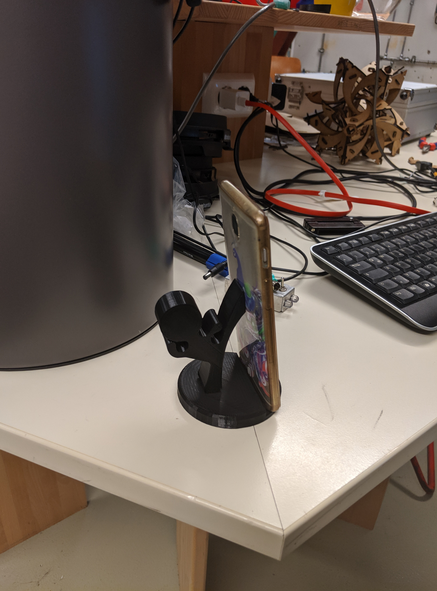
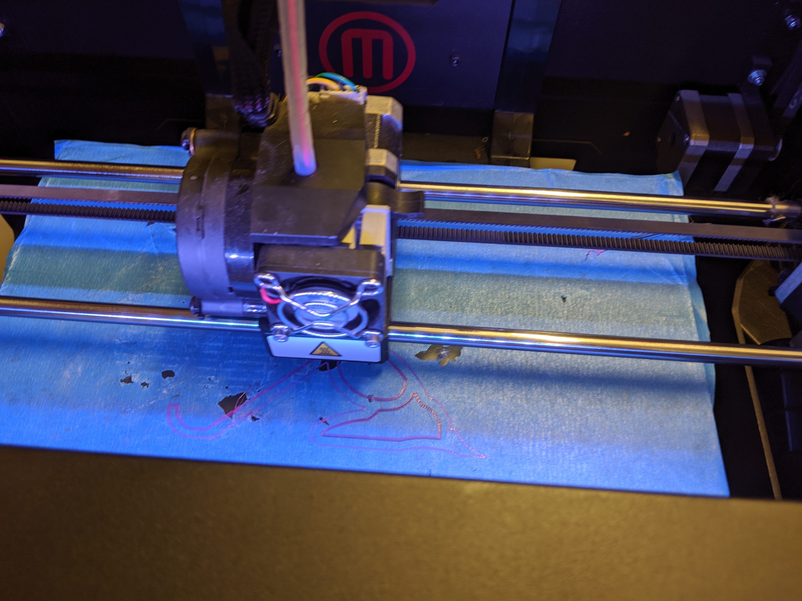
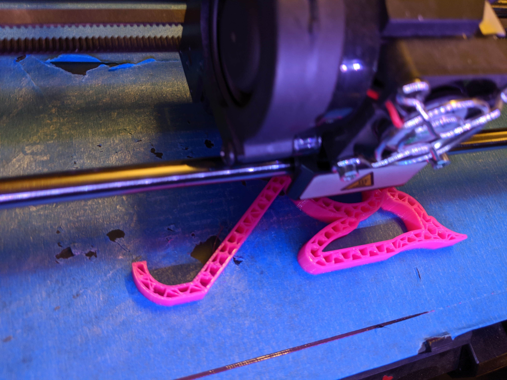
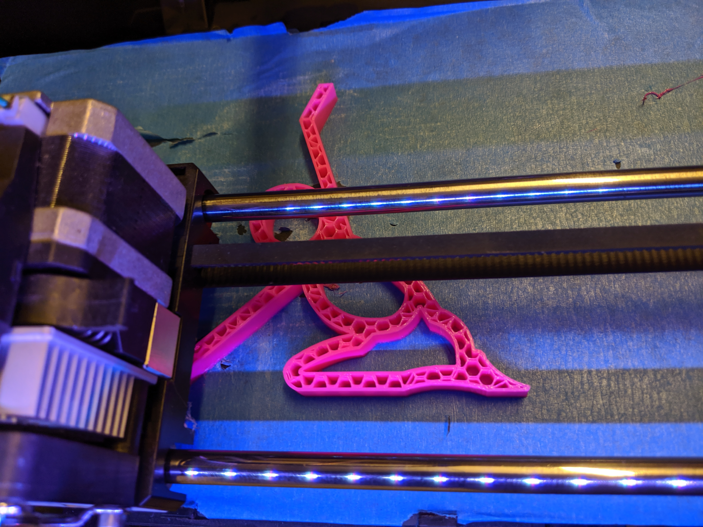
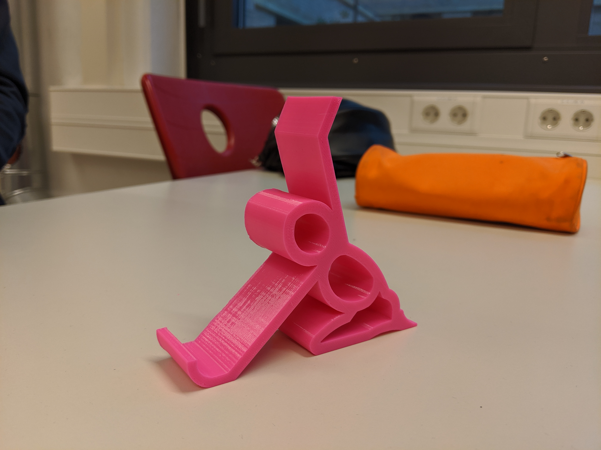
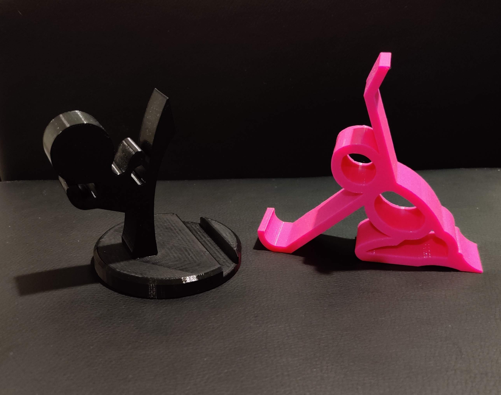
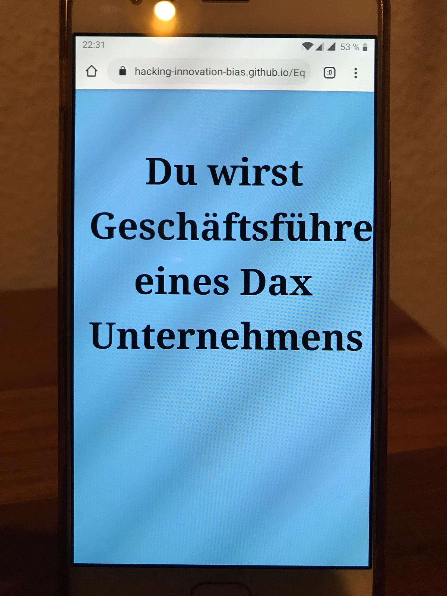

# Equality 4.0

Choose your own Future!

## Team

Anne, Stefanie, Torben

## Code

Der dokumentierte HTML Code befindet sich [hier](docs/index.html)

## Handyhalter

Zur Untermalung des Spiels haben wir zudem noch zwei Prototypen eines Handyhalters hergestellt. Dafür haben wir zwei Templates verwendet, welche wir online unter www.thingiverse.com gefunden haben. Wir haben nach Figuren gesucht, welche stereotypisch zu Jungen und Mädchen zugeordnet werden können.
Ganz dem Motto des Seminars (Pink it and shrink it) haben wir uns dafür entschieden, das weibliche Modell in Pink herzustellen. Ursprünglich wollten wir den für die Jungen designte Handyhalter in Blau herstellen, da ein blaues Material jedoch nicht verfügbar war, sind wir auf Schwarz ausgewichen. Für die Jungen haben wir einen [Judokaempfer ausgewählt](https://www.thingiverse.com/thing:3066054), der Stärke symbolisieren soll. Die Mädchen sind leider nicht so gut davon gekommen, sie bekamen eine [unterwuerfige Figur](https://www.thingiverse.com/thing:617664), die das Handy stützt. Diese subtile Message soll das Resultat des Spiels noch einmal widerspiegeln.

### Anleitung

Hergestellt wurden die Handyhalter im Laserdrucker. Für die männliche Version wurden 2 Einzelteile gedruckt, die man später ineinander stecken musste. Der Prozess hat 2,5 Stunden gedauert. Die weibliche Version konnte in einem Einzelteil gedruckt werden und dauerte insgesamt 3 Stunden.

### Fotos

        

## Dokumentation

Die Dokumentation befindet sich [hier](dokumentation.pdf).
